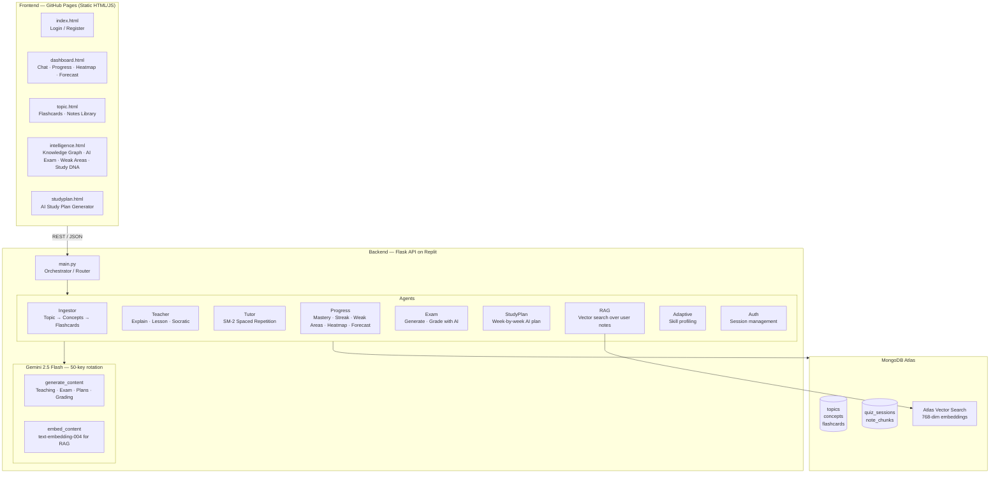

# StudyMind — AI Study Agent

> A multi-agent study application that learns how you learn. Generates personalised flashcards, adapts review schedules using spaced repetition (SM-2), teaches concepts three ways, runs AI-graded exams, and forecasts your upcoming review workload — all backed by real data from MongoDB Atlas.

Built for the **MongoDB Atlas Hackathon** and as a portfolio project for undergraduate applications.

**Live demo:** [anshumanbahekar.github.io/studymind-agent](https://anshumanbahekar.github.io/studymind-agent)  
**Backend:** Flask API on Replit — [simple-python-script--anshumanbahekar.replit.app](https://simple-python-script--anshumanbahekar.replit.app)

---

## Architecture



---

## Features

### Core study loop
| Feature | What it does |
|---|---|
| **Topic ingestion** | Type any topic → Gemini breaks it into 5–8 concepts with 3 flashcards each (recall, fill-in-the-blank, MCQ) |
| **Three teaching modes** | Explain (friend who knows everything), Lesson (step-by-step), Socratic (guided discovery) |
| **SM-2 spaced repetition** | Every answer updates ease factor, interval, and next review date using the SM-2 algorithm |
| **Adaptive quiz** | Cards surface based on due date; eval cache avoids redundant Gemini calls on repeated answers |
| **Session tracking** | Quiz sessions recorded and reflected in streak, heatmap, and forecast |

### Intelligence Hub
| Feature | What it does |
|---|---|
| **Knowledge Graph** | Canvas-rendered hub-and-spoke graph of real concepts per topic, coloured by mastery % |
| **AI Exam Generator** | Gemini produces topic-specific MCQ + short-answer exams; short answers are AI-graded with per-question feedback |
| **Weak Area Detector** | Surfaces concepts with confidence < 60%, fetches a Gemini remediation plan, links to a practice exam |
| **Study DNA** | Skill profiling per topic (0–3 scale), weighted by card difficulty |

### Study Plan Generator
| Feature | What it does |
|---|---|
| **AI-generated plans** | Gemini writes a week-by-week plan with specific daily activities, not generic templates |
| **Accordion UI** | 7-day-per-week cards collapsed by default — scan the topic, click to expand detail |
| **Dashboard ingestion** | "Start This Plan" sends the topic to the Ingestor agent and adds it to your dashboard |

### Notes & RAG
| Feature | What it does |
|---|---|
| **Notes Library** | Upload notes per topic — they're chunked, embedded, and stored in Atlas Vector Search |
| **Semantic search** | Search your own notes; results show match %, source, and keyword-highlighted snippets |
| **RAG-first teaching** | `/teach` checks for uploaded notes first; uses them as the primary source before falling back to Gemini's general knowledge |

### Dashboard analytics
| Feature | What it does |
|---|---|
| **90-day activity heatmap** | Real `quiz_sessions` aggregated per day — no synthetic data |
| **Review forecast** | SM-2 `next_review_at` dates aggregated into a 7/14/30-day bar chart — shows when your workload peaks |
| **AI recommendations** | Gemini writes a personalised study nudge based on your real mastery and due-card counts |

---

## Tech Stack

**Backend**
- Python 3.11 · Flask 3.0 · Flask-CORS
- MongoDB Atlas (PyMongo 4.7) — 8 collections: `topics`, `concepts`, `flashcards`, `quiz_sessions`, `note_chunks`, `eval_cache`, `sessions`, `users`
- Atlas Vector Search — 768-dimension embeddings via `text-embedding-004`
- Gemini 2.5 Flash (`google-genai` SDK) — 50-key rotation with automatic failover on rate limits
- SHA-256 salted password hashing · 30-day session tokens

**Frontend**
- Vanilla HTML/CSS/JS — no framework, no build step
- Instrument Serif + Plus Jakarta Sans
- Canvas-based Knowledge Graph (requestAnimationFrame rendering loop)
- GitHub Pages (static hosting)

---

## Project Structure

```
studymind-agent/              ← Replit backend
├── main.py                   ← Flask app — 26 routes
├── db.py                     ← MongoDB Atlas MCP helpers (find/insert/update/aggregate/delete)
├── requirements.txt
└── agents/
    ├── _gemini_client.py     ← Shared google-genai SDK wrapper (50-key rotation)
    ├── ingestor.py           ← Topic → concepts + flashcards (Gemini JSON generation)
    ├── teacher.py            ← Three teaching modes
    ├── tutor.py              ← SM-2 algorithm · answer evaluation · eval caching
    ├── progress.py           ← Mastery aggregation · heatmap · review forecast
    ├── exam.py               ← Exam generation + AI grading
    ├── studyplan.py          ← Week-by-week plan generation
    ├── rag.py                ← Chunking · embedding · Atlas Vector Search
    ├── adaptive.py           ← Skill profiling (0–3 scale per topic)
    ├── auth.py               ← Registration · login · session management
    └── session_tracker.py    ← Quiz session recording · streak computation

studymind-agent-main/         ← GitHub Pages frontend
└── docs/
    ├── index.html            ← Login / Register
    ├── dashboard.html        ← Main workspace (chat, progress, heatmap, forecast)
    ├── topic.html            ← Topic detail (flashcards, notes library)
    ├── intelligence.html     ← Intelligence Hub (4 tabs)
    └── studyplan.html        ← AI Study Plan Generator
```

---

## API Reference

| Method | Endpoint | Description |
|---|---|---|
| `POST` | `/auth/register` | Create account |
| `POST` | `/auth/login` | Login → session token |
| `POST` | `/ingest` | Ingest a new topic |
| `POST` | `/teach` | Teach a concept (explain/lesson/socratic) |
| `POST` | `/chat` | Orchestrated chat (routes to learn/quiz/progress intents) |
| `POST` | `/quiz/next` | Get next due flashcard |
| `POST` | `/quiz/answer` | Submit answer → SM-2 update |
| `GET` | `/progress` | Mastery, streak, weak areas, AI recommendation |
| `GET` | `/activity/heatmap` | 90-day study activity (real session data) |
| `GET` | `/review/forecast` | SM-2 cards-due forecast (7/14/30 days) |
| `POST` | `/topic/graph` | Per-topic concept nodes + mastery for Knowledge Graph |
| `GET` | `/skill/profile` | Study DNA — skill score per topic |
| `POST` | `/exam/generate` | Gemini-generated exam (MCQ + short answer) |
| `POST` | `/exam/grade` | AI grading with per-question feedback |
| `POST` | `/studyplan/generate` | AI study plan (week-by-week, topic-specific) |
| `POST` | `/notes/upload` | Chunk + embed notes → Atlas Vector Search |
| `POST` | `/notes/search` | Semantic search over user notes |
| `GET` | `/notes/list` | List uploaded note sources |
| `POST` | `/notes/delete` | Delete a note source |

---

## SM-2 Algorithm

Each flashcard stores: `ease_factor` (default 2.5), `interval` (days until next review), `confidence_score` (0–1), `times_seen`, and `next_review_at`.

After every answer:
1. Gemini evaluates the response and returns a `quality` score (0–5)
2. SM-2 updates `ease_factor` and `interval` based on quality
3. `next_review_at` is set to `now + interval days`
4. Cards with quality < 3 reset to a 1-day interval

An `eval_cache` collection stores past evaluations keyed by `(card_id, answer_hash)` — repeated identical answers skip the Gemini call entirely and return the cached score.

---

## Running Locally

**Backend**
```bash
git clone https://github.com/anshumanbahekar/studymind-agent
cd studymind-agent
pip install -r requirements.txt

# Set environment variables
export MONGODB_URI="your_atlas_connection_string"
export GEMINI_KEY_1="your_gemini_api_key"   # add up to GEMINI_KEY_50

python main.py
```

**Frontend**
```bash
git clone https://github.com/anshumanbahekar/studymind-agent-main
cd studymind-agent-main/docs
# Open index.html in a browser, or serve with:
python -m http.server 8080
```

Update the `API` constant in each HTML file to point to your local Flask server (`http://localhost:5000`).

---

## MongoDB Collections

| Collection | Purpose |
|---|---|
| `users` | Account credentials (salted SHA-256) + session tokens |
| `topics` | Top-level topics per user |
| `concepts` | Ordered concept list per topic (foundational → advanced) |
| `flashcards` | Cards with SM-2 state (`ease_factor`, `interval`, `next_review_at`, `confidence_score`) |
| `quiz_sessions` | Completed sessions (cards attempted/correct, topic ids, timestamps) |
| `note_chunks` | Chunked user notes with 768-dim embeddings for vector search |
| `eval_cache` | Gemini answer evaluations cached by `(card_id, answer_hash)` |
| `sessions` | Auth sessions (token, user_id, expiry) |

---

## Built by

**Anshuman Bahekar** — [github.com/anshumanbahekar](https://github.com/anshumanbahekar)

Built for the MongoDB Atlas Hackathon · June 2026
